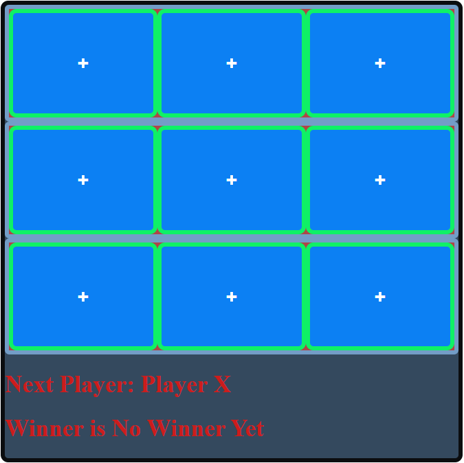

# Tic-Tac-Toe
 Tic-Tac_toe Game
 Run: copy index.html, tictactoe.jsx and styles.css into the same folder. Either drag index.html into the browser or right click and select open with using your preferred browser.

Roadmap of future improvements:
I would like to add a line that goes through the winning squares and add a refresh button.

I've been thinking about the line through the board and it seemed complicated. I think the best option is to have a picture with a line through it but you would have to do it for each square. Originally i thought it would be easier to conditionally render the squares so that when you win there is a set picture of the whole board. i think that would be a little overkill because you would need eight pictures of x's and eight o's. I think the best way would be to have 4 pictures of just a single square. Four pictures of x's and o's with each picture showing a line going either vertical, horizontal, and diagonal in each way. Then you could just replace the three winning squares with those pictures.

The refresh button would be fairly simple to add to the bottom and have it reset the states to null.

